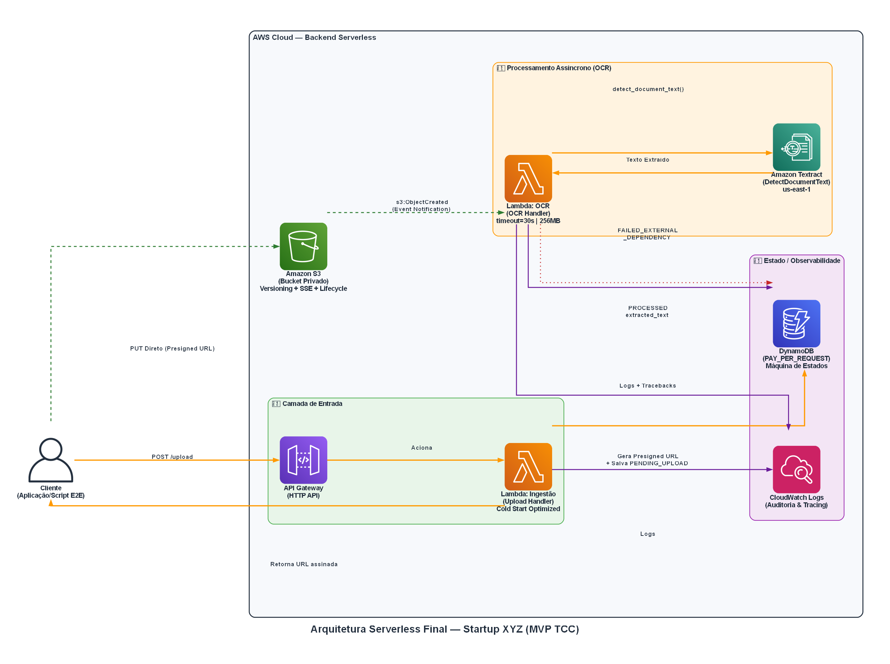

# Startup XYZ Platform — MVP de Ingestão e OCR Serverless

[](live/dev)
[](application/src)
[](https://aws.amazon.com)
[](https://github.com/hildelio/AIDocs/releases/tag/v1.0.0-defense)

---

## Visão Geral

Este repositório implementa o **MVP de uma plataforma de ingestão e extração de dados** como estudo de caso de TCC. O projeto demonstra a aplicação prática de **Platform Engineering, SRE e Cloud Architecture** para construir um pipeline serverless auditável de ponta a ponta.

**O problema resolvido:** Um cliente envia documentos (faturas, recibos) e o texto é extraído automaticamente por IA — de forma assíncrona e resiliente — sem que a API síncrona sofra timeout durante o processamento pesado.

**Objetivos técnicos demonstrados:**
- Arquitetura orientada a eventos (*event-driven*) com baixo acoplamento
- Separação de responsabilidades em 3 camadas (Handler → Service → Repository)
- Infraestrutura como Código com Terraform modular e reutilizável
- Máquina de estados determinística e auditável no DynamoDB
- Tratamento de falhas resiliente com estados explícitos de erro

---

## Documentação do Projeto

A documentação deste repositório foi construída para atender critérios rígidos de auditoria e escalabilidade. Acesse os documentos oficiais abaixo:

- 📄 [**Case Compliance Report (RTM)**](docs/CASE_COMPLIANCE_REPORT.md): Matriz de Rastreabilidade provando o atendimento de 100% dos requisitos (S3 Lifecycle, Block Public Access, IAM Least Privilege, etc.).
- 🖼️ [**Diagrama de Arquitetura Final**](arquitetura/arquitetura_serverless_startup_xyz_final.png): Visão serverless macro em alta resolução.
- 🏗️ **Architecture Decision Records (ADRs)**:
  - [ADR-001: Diretórios Live vs Modules](docs/adr/ADR-001-live-directory.md)
  - [ADR-002: Contratos de Módulos (Inputs/Outputs)](docs/adr/ADR-002-module-contracts.md)
  - [ADR-003: Grafo de Dependências IaC](docs/adr/ADR-003-module-dependency-graph.md)
  - [ADR-004: Segurança com Pre-signed URLs no S3](docs/adr/ADR-004-pre-signed-url.md)
  - [ADR-005: Estratégia de Evolução (Platform IA)](docs/adr/ADR-005-estrategia-evolucao-plataforma-ia.md)

---

## Arquitetura



O diagrama representa o fluxo real do MVP com três camadas lógicas isoladas:

| Camada | Componentes | Natureza |
|--------|------------|----------|
| **① Entrada** | API Gateway → Lambda Ingestão | Síncrona (resposta < 1s) |
| **② Processamento** | S3 Event → Lambda OCR → Amazon Textract | Assíncrona (até 30s) |
| **③ Estado / Observabilidade** | DynamoDB + CloudWatch Logs | Persistência + Auditoria |

### Fluxo de Dados (Passo a Passo)

1. O cliente faz `POST /upload` com `user_id` e `filename`
2. A **Lambda Ingestão** gera um UUID, persiste metadados no DynamoDB (`PENDING_UPLOAD`) e devolve uma **Pre-signed URL** do S3
3. O cliente faz `PUT` direto para o S3 — **bypass total do API Gateway e Lambda** (FinOps)
4. O S3 emite um evento `s3:ObjectCreated` que aciona a **Lambda OCR** de forma assíncrona
5. A Lambda OCR atualiza o status para `PROCESSING` e chama o Amazon Textract
6. O texto extraído é salvo no DynamoDB com status `PROCESSED`; erros externos geram `FAILED_EXTERNAL_DEPENDENCY`

---

## Decisões Arquiteturais (ADRs)

As decisões de design estão registradas em [`docs/adr/`](docs/adr/) como Architecture Decision Records imutáveis.

| ADR | Decisão | Por quê |
|-----|---------|---------|
| [ADR-001](docs/adr/ADR-001-live-directory.md) | `live/dev` e `live/prod` como entrypoints | Isolamento operacional com Terraform state independente por ambiente. Permite que dev e prod evoluam em ritmos distintos sem risco de contaminação de estado |
| [ADR-002](docs/adr/ADR-002-module-contracts.md) | Contratos de interface para módulos | Forçar a definição de inputs/outputs antes da implementação evita acoplamento implícito e permite que módulos sejam consumidos por múltiplos ambientes sem adaptações |
| [ADR-003](docs/adr/ADR-003-module-dependency-graph.md) | Grafo de dependência: IAM → S3 → Lambda → API GW | Ordem de provisionamento previsível que previne permissões especulativas (criar política IAM para um recurso que ainda não existe) |
| [ADR-004](docs/adr/ADR-004-pre-signed-url.md) | Acesso ao S3 via Pre-signed URLs | O bucket S3 permanece 100% privado. O cliente recebe credenciais temporárias para uma operação específica, eliminando o risco de exposição acidental e contornando o limite de payload de 10MB do API Gateway |
| [ADR-005](docs/adr/ADR-005-estrategia-evolucao-plataforma-ia.md) | Roadmap de IA em 4 fases | Desacoplar ingestão, processamento e consumo de IA permite que equipes de Infra, Engenharia e Data Science trabalhem e evoluam independentemente |

### Por que duas Lambdas separadas?

A decisão de segregar responsabilidades em duas funções independentes é deliberada:

| | Lambda Ingestão | Lambda OCR |
|---|---|---|
| **Natureza** | Síncrona | Assíncrona (event-driven) |
| **Timeout** | 3s | 30s |
| **Memória** | 128 MB | 256 MB |
| **Trigger** | API Gateway (HTTP) | S3 Event Notification |
| **Responsabilidade** | Gera UUID, Pre-signed URL, salva `PENDING_UPLOAD` | Chama Textract, atualiza estado final |
| **Isolamento garantido** | Uma falha no pipeline OCR nunca impacta a disponibilidade da API de ingestão | ✅ |

> **Por que não uma Lambda única?** Uma Lambda única que recebesse o upload e processasse o documento sofreria timeout do API Gateway (30s) durante o processamento do Textract (que pode levar até 10–15s para documentos maiores), além de tornar as responsabilidades inseparáveis e impossibilitar o escalonamento independente dos dois fluxos.

---

## Máquina de Estados

O DynamoDB é a **fonte de verdade** do ciclo de vida de cada documento. A máquina de estados garante que o pipeline seja sempre auditável, mesmo em cenários de falha:

```
                   [Lambda Ingestão]
                         │
                  PENDING_UPLOAD
                         │
              [S3 Event → Lambda OCR]
                         │
                     PROCESSING
                    /           \
             [Textract OK]   [ClientError]
                  │                │
              PROCESSED    FAILED_EXTERNAL
                            _DEPENDENCY
```

| Status | Responsável | Gatilho |
|--------|------------|---------|
| `PENDING_UPLOAD` | Lambda Ingestão | Registro criado; aguardando PUT do cliente |
| `PROCESSING` | Lambda OCR | S3 Event recebido; Textract em andamento |
| `PROCESSED` | Lambda OCR | Texto extraído com sucesso e persistido |
| `FAILED_EXTERNAL_DEPENDENCY` | Lambda OCR | `ClientError: SubscriptionRequiredException` — Textract não disponível na conta |

O estado `FAILED_EXTERNAL_DEPENDENCY` resolve dois problemas de resiliência:
1. **Poison Pill:** Sem este estado, o S3 faria retry infinito do evento, gerando loops de execução e custo incontrolável
2. **Observabilidade:** A banca pode consultar o DynamoDB e ver exatamente qual restrição externa impediu o processamento

---

## Engenharia de Plataforma (IaC Modular)

```
edn/
├── bootstrap/               # Bootstrap isolado: estado remoto (S3 + DynamoDB locking)
├── live/
│   └── dev/                 # Entrypoint dev — orquestra módulos, nunca contém lógica
│       ├── main.tf          # Composição dos módulos com valores concretos
│       ├── backend.tf       # State remoto com lock distribuído via DynamoDB
│       └── versions.tf      # Versões travadas (provider AWS, Terraform >= 1.0)
└── modules/
    ├── lambda/              # Genérico: timeout, memory_size, env vars, source_code_hash
    ├── s3/                  # Bucket privado: versioning, SSE-S3, lifecycle, public access block
    ├── dynamodb/            # PAY_PER_REQUEST com tags obrigatórias
    ├── iam/                 # Role de execução + AWSLambdaBasicExecutionRole
    ├── iam_policy_dynamodb/ # CRUD mínimo por tabela (menor privilégio)
    ├── iam_policy_s3/       # PutObject mínimo por bucket (menor privilégio)
    ├── api_gateway/         # HTTP API Gateway com integração Lambda proxy
    └── ocr_pipeline/        # Módulo composto: Lambda OCR + IAM + S3 Trigger
```

**Princípios aplicados:**
- **Zero Hardcoding:** ARNs, nomes e configurações são passados via `variables.tf` e resolvidos via `outputs.tf`
- **Menor Privilégio IAM:** Cada Lambda tem políticas com as permissões mínimas necessárias — sem wildcards
- **Módulos sem Provider:** O bloco `provider` é declarado apenas nos pontos de entrada (`live/`, `bootstrap/`), não nos módulos
- **Tags Obrigatórias:** `project`, `environment`, `owner`, `cost_center`, `managed_by` propagadas para todos os recursos via variável `map(string)`
- **Deploy Automático por Hash:** `source_code_hash = filebase64sha256(var.filename)` garante que o Terraform detecta mudanças no `artifact.zip` sem intervenção manual

---

## GitFlow e Integração Contínua (CI)

### Topologia de Branches

```
main ──────────────────────────────── Gold Master (estável, protegida)
  └── develop ──────────────────────── Branch de integração contínua
        └── feature/bootstrap-iam-ci ─ Branch de feature (histórico do MVP)
```

| Branch | Propósito | Política |
|--------|-----------|----------|
| `main` | Gold Master — código validado e apto para deploy em produção | PR obrigatório; CI deve passar; nenhum commit direto |
| `develop` | Branch de integração — recebe merges das features antes de promover para main | PR obrigatório vindo de features; merge em main via PR |
| `feature/*` | Desenvolvimento de funcionalidades isoladas | Criada a partir de develop; deletada após merge |

**Por que esta topologia?** Em um projeto acadêmico com prazo definido e sem equipe paralela, o GitFlow completo seria cerimônia sem benefício. A topologia acima é o subconjunto mínimo que demonstra maturidade de engenharia: separação entre código estável (`main`) e código em evolução (`develop`), com rastreabilidade de features via histórico de branches.

### Pipeline de CI (GitHub Actions)

O pipeline de validação em [`.github/workflows/`](.github/workflows/) executa automaticamente em todo PR aberto contra `main` ou `develop`:

```yaml
# Etapas do pipeline de CI
jobs:
  validate-infrastructure:
    steps:
      - terraform fmt -check        # Garante formatação canônica do HCL
      - terraform validate          # Valida sintaxe e tipos sem chamar a AWS
      - make architecture-check     # Valida estrutura de diretórios contra o Canon
  
  build-application:
    steps:
      - make build-app              # Empacota artifact.zip e valida hash
```

**O que o CI não faz (e por quê):** O `terraform plan` e `terraform apply` são deliberadamente excluídos do CI automático, pois exigem credenciais AWS de produção e podem gerar custos. Em um ambiente maduro, estes passos seriam adicionados em um pipeline de CD separado, acionado manualmente por um Tech Lead após revisão do plano.

### Tag de Release

O estado atual do repositório está selado sob a tag:

```
v1.0.0-defense  →  Commit: main (HEAD)
```

Esta tag representa o **Release Candidate para Defesa do TCC** — o snapshot imutável do código e infraestrutura validados durante as sessões de troubleshooting E2E.

---

## Observabilidade

- **Grupos de logs:** `/aws/lambda/startup-xyz-dev-ingestion` e `/aws/lambda/startup-xyz-dev-ocr`
- **Log de latência do Textract:** `logger.info(f"Textract call completed for {key} in {elapsed:.2f}s")`
- **Tratamento de `SubscriptionRequiredException`:** capturado via `ClientError` e persistido como `FAILED_EXTERNAL_DEPENDENCY` — nenhum erro silencioso

**Diagnóstico rápido:**
```bash
aws logs tail /aws/lambda/startup-xyz-dev-ocr --region sa-east-1 --since 30m
```

---

## Estrutura da Aplicação

```
application/
├── src/
│   ├── config.py                    # Fail-fast: RuntimeError se variável de ambiente ausente
│   ├── handlers/
│   │   ├── upload_handler.py        # Recebe evento HTTP, delega ao IngestionService
│   │   └── ocr_handler.py           # Recebe evento S3, delega ao OcrService
│   ├── services/
│   │   ├── ingestion_service.py     # Orquestra: UUID, Pre-signed URL, DynamoDB
│   │   └── ocr_service.py           # Orquestra: Textract, máquina de estados, erro
│   └── repositories/
│       ├── s3_repository.py         # generate_presigned_url com key isolation por user_id
│       ├── dynamodb_repository.py   # put_item, update_document, get_by_s3_key
│       └── textract_repository.py   # detect_document_text com log de latência
└── scripts/
    └── simulate_client_e2e.py       # Prova E2E: API → S3 PUT → Polling DynamoDB
```

**Padrões de qualidade:** Fail-Fast em config · `logger.exception()` para preservação de traceback · Cold Start Optimization (repositórios no escopo global) · Type Hints completos · Zero `boto3` no Handler.

---

## Execução

```bash
# 1. Build do artefato da aplicação
make build-app

# 2. Deploy da infraestrutura
make plan    # Gera e exibe o plano de execução
make apply   # Aplica o plano aprovado

# 3. Validação E2E completa
python application/scripts/simulate_client_e2e.py \
  https://<api-id>.execute-api.sa-east-1.amazonaws.com/

# 4. Qualidade e governança
make fmt && make validate && make architecture-check

# 5. Gerar diagrama de arquitetura atualizado
cd arquitetura && python arquitetura_serverless_startup_xyz_final.py

# 6. Destruição do ambiente
make destroy  # Nota: esvaziar S3 antes via script se versioning ativo
```

---

## Roadmap

| Versão | Status | Entrega |
|--------|--------|---------|
| v0.1.0 | ✅ | Bootstrap, IAM, CI/CD scaffolding |
| v0.2.0 | ✅ | Lambda Ingestão, S3, DynamoDB, API Gateway |
| v0.3.0 | ✅ | Pipeline OCR assíncrono (Lambda OCR + Textract + S3 Event) |
| v0.4.0 | ✅ | Máquina de estados e tratamento de erros externos |
| **v1.0.0** | **🎓 Release Candidate para Defesa** | **Diagrama final, GitFlow, documentação completa** |
| v1.1.0 | 🔮 | Dead Letter Queue (SQS DLQ) para retry automático |
| v1.2.0 | 🔮 | Ambiente `prod` com state e roles separados |
| v1.3.0 | 🔮 | Integração com Amazon Bedrock (sumarização RAG) |

